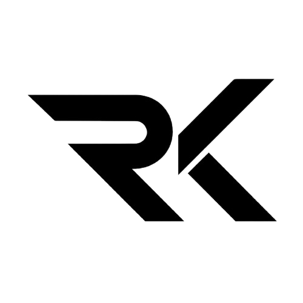

<div align="center">



# Kishwar Rengasamy — Portfolio

**Designer · Developer · Creative Technologist**

_Crafting thoughtful digital experiences at the intersection of design and engineering._

[](https://react.dev)
[](https://www.typescriptlang.org)
[](https://tailwindcss.com)
[](https://vitejs.dev)
[](https://www.framer.com/motion/)
[](https://www.emailjs.com)
[](./LICENSE)

<br />

[🌐 Live Demo](#) · [📬 Contact](mailto:kishwarrengasamy216@gmail.com) · [💼 LinkedIn](https://www.linkedin.com/in/kishwar-rengasamy) · [🐙 GitHub](https://github.com/KishwarRengasamy)

</div>

---

## 📋 Table of Contents

- [Overview](#-overview)
- [Features](#-features)
- [Tech Stack](#-tech-stack)
- [Project Structure](#-project-structure)
- [Getting Started](#-getting-started)
- [Environment Variables](#-environment-variables)
- [Scripts](#-scripts)
- [Contact](#-contact)
- [License](#-license)

---

## 🎯 Overview

A high-performance personal portfolio website built with modern web technologies. Designed to showcase projects, skills, and professional experience with a minimal Apple/Vercel-inspired aesthetic — featuring fluid animations, a fully functional contact form, and zero placeholder content.

> _"Whether it's an internship, a research collaboration, or a product idea worth prototyping — I read every message."_

---

## ✨ Features

| Feature                      | Description                                                  |
| ---------------------------- | ------------------------------------------------------------ |
| 🎨 **Minimal Aesthetic**     | Clean Apple/Vercel-inspired design with generous whitespace  |
| 🌙 **Dark Mode**             | Seamless system-preference-aware dark/light theming          |
| ⚡ **Micro-animations**      | Fluid Framer Motion transitions and scroll-triggered reveals |
| 📬 **Working Contact Form**  | EmailJS-powered form with success/error states               |
| 🖼️ **Custom Branding**       | Transparent RK logo, custom favicon at 16×16, 32×32, 48×48   |
| 📱 **Fully Responsive**      | Optimized layouts for desktop, tablet, and mobile            |
| 🔗 **Embedded Social Links** | Gmail, LinkedIn, GitHub with hidden URLs — only labels shown |
| 📄 **Downloadable Resume**   | One-click PDF resume download from the hero section          |
| 🎭 **Preloader**             | Branded loading screen on first visit                        |
| 🏆 **Achievements Section**  | Certifications and accomplishments showcased cleanly         |
| 🛠️ **Adobe Creative Suite**  | Skills section with real Adobe logos (Ae, Ps, Lr)            |

---

## 🛠 Tech Stack

<table>
  <tr>
    <td align="center" width="120"><strong>Frontend</strong></td>
    <td>React 19, TypeScript 5.8, JSX</td>
  </tr>
  <tr>
    <td align="center"><strong>Styling</strong></td>
    <td>Tailwind CSS 4.x, CSS Variables, Space Grotesk + Inter fonts</td>
  </tr>
  <tr>
    <td align="center"><strong>Animation</strong></td>
    <td>Framer Motion 12 — scroll reveals, hover states, stagger</td>
  </tr>
  <tr>
    <td align="center"><strong>Routing</strong></td>
    <td>TanStack Router v1</td>
  </tr>
  <tr>
    <td align="center"><strong>Email</strong></td>
    <td>EmailJS — serverless contact form</td>
  </tr>
  <tr>
    <td align="center"><strong>Icons</strong></td>
    <td>Lucide React</td>
  </tr>
  <tr>
    <td align="center"><strong>Build</strong></td>
    <td>Vite 8, TanStack Start</td>
  </tr>
  <tr>
    <td align="center"><strong>UI Primitives</strong></td>
    <td>Radix UI (accessible, unstyled)</td>
  </tr>
</table>

---

## 📁 Project Structure

```
portfolio/
├── public/                    # Static assets
│   ├── rk_logo.png            # Transparent RK brand logo
│   ├── favicon.png            # Browser tab favicon
│   ├── resume.pdf             # Downloadable resume
│   ├── kishwar.jpg            # Profile photo
│   ├── adobe_aftereffects.png # Skill icon
│   ├── adobe_photoshop.png    # Skill icon
│   └── adobe_lightroom.png    # Skill icon
│
├── src/
│   ├── components/
│   │   ├── portfolio/         # Page section components
│   │   │   ├── Nav.tsx        # Navigation with scroll state
│   │   │   ├── Hero.tsx       # Landing section + resume download
│   │   │   ├── About.tsx      # About me section
│   │   │   ├── Skills.tsx     # Technical skills grid
│   │   │   ├── Experience.tsx # Work experience timeline
│   │   │   ├── Projects.tsx   # Featured projects
│   │   │   ├── Achievements.tsx # Certifications
│   │   │   ├── Contact.tsx    # EmailJS contact form + social links
│   │   │   ├── Preloader.tsx  # Initial loading screen
│   │   │   └── SectionDivider.tsx
│   │   └── ui/                # Radix UI component library
│   │
│   ├── routes/
│   │   ├── __root.tsx         # Root layout + SEO meta
│   │   └── index.tsx          # Home page
│   │
│   ├── hooks/                 # Custom React hooks
│   ├── lib/                   # Utility functions
│   └── styles.css             # Global styles + Tailwind tokens
│
├── .env                       # Local env vars (gitignored)
├── .env.example               # Env template for contributors
├── vite.config.ts             # Vite configuration
├── tsconfig.json              # TypeScript configuration
└── package.json
```

---

## 🚀 Getting Started

### Prerequisites

- **Node.js** ≥ 18
- **npm** or **bun**

### Installation

```bash
# 1. Clone the repository
git clone https://github.com/KishwarRengasamy/Portfolio.git
cd Portfolio

# 2. Install dependencies
npm install
# or
bun install

# 3. Set up environment variables
cp .env.example .env
# Then fill in your EmailJS credentials in .env

# 4. Start the development server
npm run dev
# or
bun run dev
```

Open [http://localhost:5173](http://localhost:5173) in your browser.

---

## 🔐 Environment Variables

Create a `.env` file in the project root (copy from `.env.example`):

```env
VITE_EMAILJS_SERVICE_ID=your_service_id
VITE_EMAILJS_TEMPLATE_ID=your_template_id
VITE_EMAILJS_PUBLIC_KEY=your_public_key
```

> **Security note:** The public key is restricted by [allowed origins](https://dashboard.emailjs.com/admin/account/security) in your EmailJS dashboard, so it is safe for frontend use. **Never commit your actual `.env` file** — it is listed in `.gitignore`.

To get your EmailJS credentials:

1. Create a free account at [emailjs.com](https://www.emailjs.com)
2. Add an email service (Gmail recommended)
3. Create an email template with variables: `{{from_name}}`, `{{from_email}}`, `{{subject}}`, `{{message}}`, `{{to_name}}`
4. Set **Reply-To** to `{{from_email}}` in your template settings

---

## 📜 Scripts

| Command           | Description                       |
| ----------------- | --------------------------------- |
| `npm run dev`     | Start development server with HMR |
| `npm run build`   | Build for production              |
| `npm run preview` | Preview production build locally  |
| `npm run lint`    | Run ESLint                        |
| `npm run format`  | Run Prettier formatter            |

---

## 📬 Contact

| Platform     | Link                                                                               |
| ------------ | ---------------------------------------------------------------------------------- |
| **Email**    | [kishwarrengasamy216@gmail.com](mailto:kishwarrengasamy216@gmail.com)              |
| **LinkedIn** | [linkedin.com/in/kishwar-rengasamy](https://www.linkedin.com/in/kishwar-rengasamy) |
| **GitHub**   | [github.com/KishwarRengasamy](https://github.com/KishwarRengasamy)                 |

---

## 📄 License

This project is licensed under the **MIT License** — see the [LICENSE](./LICENSE) file for details.

---

<div align="center">

**Designed & Developed by Kishwar Rengasamy**

_Built with React · Tailwind CSS · Framer Motion_

⭐ If you found this helpful, please consider giving this repo a star!

</div>
